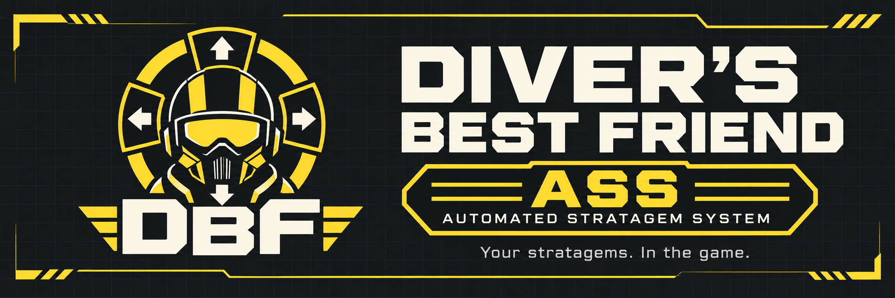
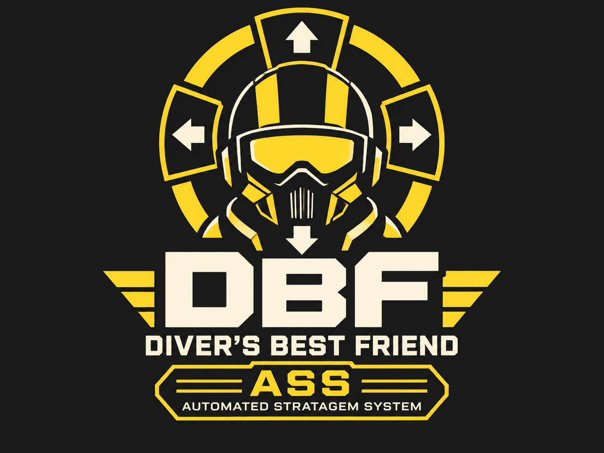

# Diver's Best Friend

**Your stratagems. In the game. No OCR. No Python. No AutoHotkey. Just a nice ASS.**

*Automated Stratagem System*

Select stratagems through a native in-game wheel or list, then throw the beacon normally. Diver's Best Friend runs inside HELLDIVERS 2 through Bingus Shared Loader, using the game's UI and live stratagem data. No external application needs to run while you play.

[Canary release notes](https://github.com/HWG90/DiversBestFriend/releases/tag/canary-r39) | [Stable download](https://github.com/HWG90/DiversBestFriend/releases/latest) | [Nexus Mods](https://www.nexusmods.com/helldivers2/mods/16658) | [Installation and controls](docs/INSTALLATION.md) | [Changelog](CHANGELOG.md)

## Current main build: R41 - Streamlined Options

I forgot that not everyone has MCM yet. The Bingus Mod Options Menu had too many appearance controls, leaving too little room for the blacklist. R41 trims the menu to Enable Mod, Mode, Sound feedback, Experimental layout, Preset, Controller Select on Release and Input interval, plus the three mission blacklist entries.

Wheel, icon and center-label sizing, opacity and color controls are suppressed. Their saved values remain intact; presets still work. Vertical offset is disabled at zero. MCM support remains upcoming, and MCM is not required.

Build with `python scripts/build.py` to produce `DiversBestFriend-R41-MissionBlacklist.zip`. Install one revision; stable and canary share addon identity, settings and bindings. See [R41 notes](docs/RELEASE-r41.md) and [blacklist details](docs/BLACKLIST.md).

## Selection modes

| Mode | Controls | Layout |
| --- | --- | --- |
| Native wheel | Mouse/stick pointing + Confirm | Eight slots, with Next/Previous to change pages |
| Keybindings list | Next/Previous + Confirm | Scrolls in list order and wraps around; camera control remains available |
| Experimental: Cards | Mouse/stick pointing + Confirm | Up to 16 native stratagem rows arranged in a circle |
| Experimental: Expanded wedges | Mouse/stick pointing + Confirm | Up to 16 entries on one wheel |

Radial layouts retain the original stratagem list at the top left. Mouse/stick pointing takes camera control while the menu is open and restores it when closed.

- **Select on Release:** optional and off by default. With a Hold menu binding, point at an entry and release to select. Return the pointer to the center before releasing to cancel. List mode uses Confirm.
- **Input interval:** adjustable from 0 to 250 ms, default 70 ms, for both Confirm and Select on Release.
- **Cooldown indicators:** native and expanded wheels dim unavailable icons during cooldown or delivery and show the selected entry's remaining time. List and Cards retain their native timer displays.
- **Appearance:** optional full-color icons, adjustable expanded-wedge darkness and opacity, and automatic centering. Leave the vertical offset at 0 unless you want a custom position.
- **Scrambled codes:** selection follows the current required sequence. If it changes during entry, reopen the menu and retry.

The mod enters the selected code through the normal game input path. Availability restrictions still apply, and you throw the beacon yourself.

## Requirements

This project would not exist without **[CowboyBingus](https://github.com/CowboyBingus)** and their shared modding infrastructure.

| Dependency | Version | Purpose |
| --- | --- | --- |
| [Bingus Shared Loader](https://github.com/CowboyBingus/BingusSharedLoader/releases/latest) | v18 / API 1 | Loads the addon |
| [Mod Bindings Menu](https://github.com/CowboyBingus/ModBindingsMenu/releases/latest) | v2.0 or newer / API 1 | Configurable selection controls |
| [Mod Options Menu](https://github.com/CowboyBingus/ModOptionsMenu) | v1.0.1 / API 1 | In-game settings |
| HELLDIVERS 2 on Windows/Steam | Build 25480438 | Supported game build |
| Arsenal or a compatible mod manager | Installation only | Deploys the addon and dependencies |

Install dependencies separately; they are not bundled. The original external Stratagem Wheel app, Equipped Stratagems exporter, and CowboyBingus' gameplay megapack are not required. See [Credits](CREDITS.md) for the contributions and earlier work behind the project.

## Quick start

1. Close the game and install the three dependencies above.
2. Import the release ZIP into Arsenal, enable it, and deploy. Follow Shared Loader's installation and priority instructions.
3. Restart the game. Open **MODS > Diver's Best Friend**, choose a selection mode, and Apply.
4. Check **Next stratagem**, **Previous stratagem**, and **Confirm stratagem** in the native bindings menu's **MODS** tab. Mouse defaults are Wheel Down, Wheel Up, and Mouse 1 respectively.
5. Open the normal stratagem menu in a mission, select an available entry, and Confirm. Keep the menu open until the code finishes, then throw normally. Alternatively, enable **Select on Release** for a radial layout.

Arsenal lists the mod as **Diver's Best Friend - Automated Stratagem System (ASS)**, with the revision in its description.

For detailed setup and troubleshooting, see [Installation and controls](docs/INSTALLATION.md). Game updates may require a new mod release because this implementation depends on build-specific native functions and UI layouts.

## About the project

I created this because I was getting frustrated with inconsistent OCR in my original Stratagem Wheel helper. Reading live game data and putting the menu inside the game made more sense than continuing to read the screen.

**This was vibe-coded with GPT-6 Astra**, with me directing development, testing in-game, and iterating on feedback. It's a personal project, but I'm happy to share it.

Community modding tools make this native implementation possible. This is an independent fan project with no official support or endorsement from Arrowhead or Sony. HELLDIVERS 2 and its assets belong to their respective owners.

## Feedback and license

[Report an issue](https://github.com/HWG90/DiversBestFriend/issues) with your mod revision, game build, selection mode/layout, and steps to reproduce the problem. Relevant entries from `DiversBestFriend.log` and `DiversBestFriend-native.log` can help. Please report this mod's bugs here, rather than to the dependency maintainers.

The project code is [MIT licensed](LICENSE). The game and separately installed dependencies retain their own licenses and ownership.

[Credits](CREDITS.md) | [Development guide](docs/DEVELOPMENT.md)

## Project branding

  

[Compact logo](assets/dbf-logo-4x3.png) | [Wide banner](assets/banner-dbf.png) | [Branding guide](assets/BRANDING.md)
