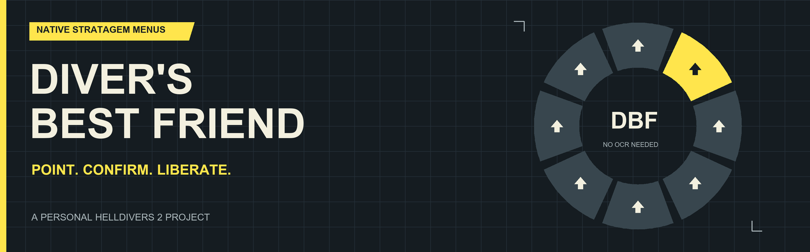

# DiversBestFriend

**Your stratagems. In the game. No OCR.**

Diver's Best Friend is a personal HELLDIVERS 2 project that brings stratagem selection into the game's own UI. Choose an emote-style native wheel, a keyboard-driven list, or an experimental radial layout. Point or navigate, press Confirm, and throw the beacon normally.

I made this because I was getting frustrated with how inconsistent OCR was in my original Stratagem Wheel helper. Reading the screen kept getting in the way of using the tool. This project grew out of that helper and the Equipped Stratagems mod: read the live game data and put the menu inside the game instead.

**This was vibe-coded with GPT-6 Astra**, with me directing the project, testing it in-game, reporting bugs, and iterating on what actually worked. It's a personal project, but I'm happy to share it. Expect a hobby project, not a polished or officially supported product.

[Download the latest build](https://github.com/HWG90/DiversBestFriend/releases/latest) · [Installation and controls](docs/INSTALLATION.md) · [Credits](CREDITS.md) · [Development](docs/DEVELOPMENT.md)

R30 clears the stale return-to-primary weapon request when reopening the menu for the optional **Select on Release** setting, disabled by default. In radial modes, enable it and use a Hold menu binding to point and release without a separate Confirm button. [R30 test release](https://github.com/HWG90/DiversBestFriend/releases/tag/r30) needs in-game controller validation.

## What it does

| Mode | Selection | Layout |
| --- | --- | --- |
| Native wheel | Native mouse/stick pointing + Confirm | Eight slots; Next/Previous page through additional entries |
| Keybindings — list | Next/Previous + Confirm | Original list order, wrapping top to bottom; camera stays available |
| Experimental: Cards | Mouse/stick pointing + Confirm | Up to 16 copied native stratagem rows arranged radially |
| Experimental: Expanded wedges | Mouse/stick pointing + Confirm | Up to 16 entries on one wheel, without paging |

The radial layouts retain the original stratagem list at the top left. Other features include native cursor tracking, an optional full-color icon mode, adjustable expanded-wedge darkness/opacity, dynamic mission entries, cooldown/delivery indicators, and an adjustable vertical offset. Radial pointing takes camera control while the menu is open; closing it restores camera control.

This is a **native in-game implementation**: it runs inside HELLDIVERS 2 through Bingus Shared Loader, uses the game's UI widgets and live stratagem definitions, and feeds the normal stratagem input path. There is **no external application to run while playing**: no OCR engine, overlay helper, AutoHotkey script, external input sender, or companion executable. A mod manager is used to install/deploy it, and the in-game dependencies below are required.

Confirm enters the selected code; it does not automatically throw, spawn equipment, or bypass the game's availability checks. Keep the stratagem menu open until the code finishes.

## Requirements — and a big thank-you

This would not exist without **[CowboyBingus](https://github.com/CowboyBingus)** and the shared modding infrastructure they've made available.

| Dependency | Required version/interface | What it provides |
| --- | --- | --- |
| [Bingus Shared Loader](https://github.com/CowboyBingus/BingusSharedLoader/releases/latest) | v18 / API 1 for the documented game build | Loads the addon into the game's LuaJIT environment and provides shared logging |
| [Mod Bindings Menu](https://github.com/CowboyBingus/ModBindingsMenu/releases/tag/v2.0) | v2.0 | Native configurable Next, Previous, and Confirm actions |
| [Mod Options Menu](https://github.com/CowboyBingus/ModOptionsMenu) | v1.0.1 / API 1 | In-game mode, layout, icon-color, enable, and offset settings |
| HELLDIVERS 2 on Windows/Steam | Build **25480438**; game.dll PE timestamp **1790161983** | The native layouts and function signatures this version checks |
| Arsenal or a compatible mod manager | Installation only | Imports and deploys the addon ZIP and dependencies |

Install the dependencies separately; they are not bundled. CowboyBingus' other gameplay mods and Vanilla Plus Megapack are **not required**. Neither the older Equipped Stratagems exporter nor the original external Stratagem Wheel app is required. See [credits and acknowledgements](CREDITS.md) for the distinction between dependencies, earlier work, and the broader modding ecosystem.

## Quick start

1. Close the game. Install the three dependencies above and the ZIP from [Releases](https://github.com/HWG90/DiversBestFriend/releases/latest).
2. Enable them in Arsenal and deploy. Follow the loader's priority instructions: with Arsenal's default priority, Shared Loader goes last; with first-mod priority enabled, it goes first.
3. Restart. In the **MODS** options tab, open **Diver's Best Friend**, choose a selection mode, and Apply.
4. In the native keyboard/controller bindings **MODS** tab, assign **Next stratagem**, **Previous stratagem**, and **Confirm stratagem**.
5. Open the normal stratagem menu in a mission, select an available entry, and Confirm. Once the code completes, throw normally.

Arsenal displays **Diver's Best Friend - Automated Stratagem System (ASS)**, with the current revision in its description. Release ZIPs use `DiversBestFriend-R#-RecentFeature.zip`. In-game options and bindings use **Diver's Best Friend**; logs use `DiversBestFriend.log` and `DiversBestFriend-native.log`. Its stable mod GUID and setting IDs are preserved so existing installations update correctly.

## Status

The current build is **r24 - Cooldown Indicators**. Native wheel and Expanded wedges gray out and dim icons during cooldown or incoming delivery; pointing at one shows its remaining time below the name. Colors restore at expiry. This also works when full-color icons are off. List and copied Cards retain their original native timer displays. It is a cooldown/delivery indicator, not a complete check for every restriction such as charges or jamming.

 Expanded wedges default to **70% darkness / 75% opacity** for better contrast. Both are adjustable in Mod Options; **0% darkness / 30% opacity** restores the earlier look. Selected wedges remain yellow and at least 95% opaque. Row-card blur is not included because its native background material has no wedge-mask texture binding.

The r21 modes/layouts were confirmed working in-game by the author. r22 centering, r23 appearance, and r24 cooldown indicators pass isolated regression tests but still need specific in-game visual verification. Leave **Radial vertical offset (down)** at **0** for automatic centering; remove any previously saved 575-unit workaround.

Native addresses are build-specific. Updates can require a new release. [Troubleshooting](docs/INSTALLATION.md#troubleshooting) explains the logs and known limitations.

## About modding support

From my perspective, this experiment exists because the current modding environment has been relatively permissive in practice, alongside the work of community modders. That is an observation about what is possible right now, **not a verified statement that Arrowhead's rules authorize this mod**, an endorsement, or a promise that restrictions will stay the same. I could not verify an official policy permitting this implementation. Arrowhead's [own troubleshooting guidance](https://arrowhead.zendesk.com/hc/en-us/articles/20049276310300-I-have-Error-code-0x44415441) notes that outdated mods can stop the game loading after updates.

HELLDIVERS 2 and its in-game assets belong to their respective owners. This is an independent fan project, not an Arrowhead or Sony product.

## License and feedback

The project code is [MIT licensed](LICENSE). The game and separately installed dependencies retain their own ownership and terms. Bug reports and small improvements are welcome; include the release, game build, selected mode/layout, and relevant logs. Please report DiversBestFriend bugs here rather than treating CowboyBingus as its maintainer.
