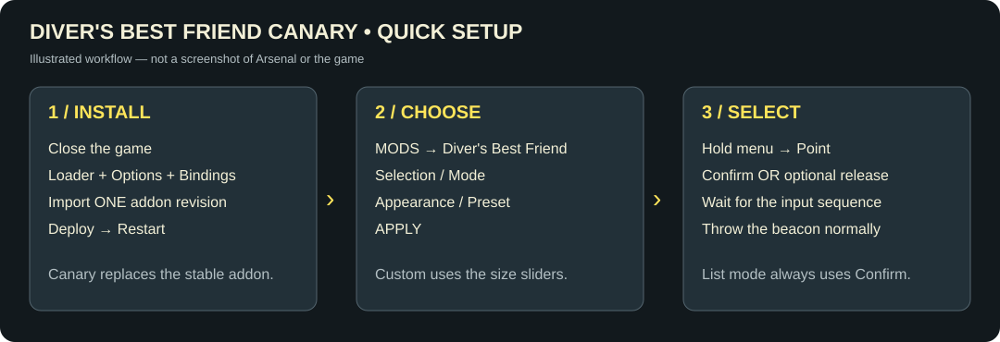

# Installation and controls

## Install

1. Close HELLDIVERS 2. Install [Bingus Shared Loader v18 / API 1](https://github.com/CowboyBingus/BingusSharedLoader/releases/latest), [Mod Bindings Menu v2](https://github.com/CowboyBingus/ModBindingsMenu/releases/tag/v2.0), and [Mod Options Menu v1.0.1](https://github.com/CowboyBingus/ModOptionsMenu) separately.
2. Import [DiversBestFriendCanary-R33-Polish.zip](https://github.com/goosethulhu/DiversBestFriend/releases/tag/canary-r33) into Arsenal. Enable **one** Diver's Best Friend revision. Canary uses the stable addon identity and replaces it; settings are retained.
3. Deploy and restart. Shared Loader must win the startup-resource conflict; follow its current ordering and Purge/Deploy instructions.
4. Open **MODS > Diver's Best Friend**. Set **Selection / Mode**, then **APPLY** before leaving the menu. Configure Next, Previous and Confirm under **Mod Bindings Menu > Diver's Best Friend**.

Target: Windows/Steam build **25480438**, game.dll PE timestamp **1790161983**. Native signatures reject unsupported builds. No external input or OCR app is required. The Equipped Stratagems exporter is not required.

## Choose a layout

| Mode | Controls | Presentation |
| --- | --- | --- |
| Native wheel | Mouse/stick + Confirm, or optional release | Eight slots; Next/Previous changes pages |
| Keybindings - list | Next/Previous + Confirm | Original list, top-to-bottom with wrap; camera remains available |
| Experimental / Cards | Mouse/stick + Confirm, or optional release | Original row cards around the center, up to 16 |
| Experimental / Expanded wedges | Mouse/stick + Confirm, or optional release | Up to 16 wedges on one wheel |

The original top-left list remains available. R33 removes R32's centered detail card and restores the original wheel caption/countdown.

## Controls: examples

**Mouse, explicit confirmation:** use your game's Hold binding for Display Stratagem List. Defaults for this mod are Next = mouse wheel down, Previous = mouse wheel up, Confirm = Mouse 1. Hold the menu, point, press Confirm, wait for code entry, then throw normally. Wheel mode captures the mouse while open.

**Controller, release selection:** choose a radial layout. Keep the game's Display Stratagem List on a **Hold** binding. Enable **Controller / Select on Release** and Apply. Hold the menu, point with the stick, and release the menu button. No extra Confirm binding is required. Center the stick before release to cancel; throw the beacon normally after selection. Start with a 70–100 ms input interval.

**Controller, explicit confirmation:** leave Select on Release off. Assign an unused button to Confirm through Mod Bindings Menu. Hold the menu, point, and press Confirm while still holding the menu button. Assign Next/Previous if using multiple native-wheel pages. Choose bindings that do not conflict with your gameplay controls.

**List:** assign Next/Previous/Confirm to comfortable buttons. Hold the stratagem menu, navigate and confirm. Select on Release does not apply to this mode.

## Settings

All options stay under one mod category, grouped with labels and row spacing. [Mod Options Menu's documented API](https://github.com/CowboyBingus/ModOptionsMenu#for-mod-authors) supports spacing but does not expose per-option dynamic visibility. Layout-specific controls remain visible and are identified in their descriptions.

| Group | Options |
| --- | --- |
| Selection | Enable Mod, Mode, Sound feedback |
| Appearance | Experimental layout, Preset, Wheel size, Icon size, Center label size, Native wheel opacity, Full-color icons, Expanded wedge darkness/opacity |
| Controller | Select on Release (off by default) |
| Advanced | Input interval, Radial vertical offset |

**Presets:** Custom uses your saved size sliders. Compact = 85% wheel / 100% icons / 95% label. Standard = 100% for all three. Large = 115% / 110% / 110%. Presets do not overwrite custom sliders or opacity/color values. Switch back to Custom to use the sliders.

**Sizing:** wheel size affects native/expanded wheels and Cards spacing. Icon/center-label sizing applies to native and expanded wheels and is relative to overall wheel size. The background opacity controls are separate for native and expanded wheels. Selected highlights stay visible. List geometry remains native. Sizes range from 70–130%; large settings may crowd long names or high-slot-count wheels.

**Sounds:** a native UI tick marks a changed target; the same tick marks a native-wheel page change; a different native wheel action cue marks an accepted input job. This cue does not certify that the beacon is equipped. Normal game input/equip sounds remain. Rapid changes are throttled and held confirmation does not repeat the cue. Turn Sound feedback off to disable the added cues.

**Input interval:** 0–250 ms, default 70. Zero sends at most one direction per frame. A sequence keeps its starting interval. Release selection temporarily uses native Press behavior while entering the code, restoring Hold afterward. No saved key/button assignment is changed.

**Centering:** vertical offset 0 uses automatic centering. Positive values move down. Wheel-size changes preserve the center and angular cursor selection.

## Troubleshooting and status messages

Status details are recorded in `%LOCALAPPDATA%/CowboyBingus/Helldivers2/Logs/DiversBestFriendCanary.log`; call checkpoints are in `DiversBestFriendCanary-native.log`. Not every diagnostic is shown on screen.

| Message or symptom | Meaning and action |
| --- | --- |
| Requires Mod Bindings Menu v2 / Waiting for native bindings | Check dependency deployment and restart; configure the bindings. |
| Requires a Hold menu binding | Change the game's Display Stratagem List binding to Hold for release selection. |
| Close and reopen the menu before confirming | A partial or previous code is present. Close/reopen, then retry. |
| Stratagem code changed; close and reopen the menu | Scrambling changed during entry. Reopen before retrying. Leaving the effect does not require restarting the mod. |
| Manual direction input detected / Native sequence changed | Manual input or game state interrupted the sequence. Reopen and try again. |
| Game rejected the selected code or availability | The native matcher refused it. Check cooldown, charges, jamming and current availability. |
| Waiting for native completion | Code entry ended; the native menu/equip transition is still processing. Wait briefly; completion wait is bounded. |
| Selection sound unavailable | Added audio is disabled for this session; selection continues. Retain the log if reporting it. |
| Unsupported game build / Native signature changed | This build needs revalidation after an update. Install a compatible release. |
| Wheel is too large / label crowds icons | Try Compact or Custom sizes. Reset vertical offset to 0 if misplaced. |
| Settings do nothing | Press APPLY. Choose Custom for size sliders; check the option's layout description. |
| Crash when opening | Disable the addon and preserve both canary logs. Report revision, game build, layout, resolution, HUD scale and other UI mods. |

R31 scrambling and post-effect recovery were reported working by the author. R33 sound character, volume and new sizing, plus the R34 page-flip cue, still need in-game validation. To roll back, close the game and deploy a known-working release with only one revision enabled.
